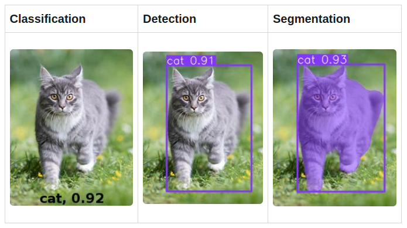

# IA : Détection d'objet sur image

## 📌 Sommaire:

I. [Badges](#🎯-badges)

II. [Introduction](#🌟-introduction)

III. [Explications](#📖-explications)

IV. [Cas concret](#💻-cas-concret)


## 🎯 Badges

[](https://www.php.net/)
[](https://www.ultralytics.com/fr/yolo)
[](https://universe.roboflow.com)

## 🌟 Introduction

La détection d'objets est une tâche de vision par ordinateur qui consiste à identifier et localiser des objets dans des images ou des vidéos. Il s’agit d’un élément important de nombreuses applications, telles que les voitures autonomes, la robotique et la vidéosurveillance.

Il existe plusieurs types de vision par ordinateur : 

- La ***classification*** d'images déterminent la classe d'un objet sur l'image et renvoient son nom ainsi que la probabilité de cette prédiction.

- La ***détection*** d'objets, en plus du type et de la probabilité de l'objet, renvoient aussi les coordonnées de l'objet sur l'image : x, y, largeur et hauteur. Ces réseaux peuvent détecter plusieurs objets dans une image et leurs boîtes englobantes.

- La ***segmentation*** d'images détectent non seulement le type d'objets et leurs boîtes englobantes, mais aussi les formes précises des objets sur l'image.


---

Au fil des années, de nombreuses méthodes et algorithmes ont été développés pour rechercher des objets dans les images et leurs positions. La meilleure qualité dans l’exécution de ces tâches provient de l’utilisation de réseaux de neurones convolutifs (CNN).

## 📖 Explications :

### Mais qu'est-ce qu'un réseau de neurones convolutifs (CNN) ?

Pour faire simple, les CNN sont des modèles puissants pour reconnaître et classer des images. Ils utilisent des opérations de convolution pour détecter automatiquement les caractéristiques importantes des images. Cela réduit la complexité des calculs tout en offrant de bonnes performances.

### Exemple d'Opération de Convolution

Pour mieux comprendre, voici un petit exemple :

1. **Image d'origine (5x5 pixels) :**
    ```
    1 1 1 0 0
    0 1 1 1 0
    0 0 1 1 1
    0 0 1 1 0
    0 1 1 0 0
    ```

2. **Filtre (ou noyau) (3x3 pixels) :**
    ```
    1 0 1
    0 1 0
    1 0 1
    ```

3. **Convolution :**
    - Le filtre se déplace sur l'image, pixel par pixel.
    - À chaque position, il multiplie les valeurs de l'image par les valeurs du filtre et additionne les résultats.

4. **Calcul de Convolution à une position :**
    - Position du filtre : en haut à gauche de l'image.
    - Multiplications et somme :
        ```
        1*1 + 1*0 + 1*1
        0*0 + 1*1 + 1*0
        0*1 + 0*0 + 1*1
        = 1 + 0 + 1 + 0 + 1 + 0 + 0 + 0 + 1
        = 4
        ```

5. **Carte de Caractéristiques (résultat de la convolution) :**
    ```
    4 3 3 ...
    1 4 4 ...
    1 2 4 ...
    ...
    ```

### Qu'est-ce que le Pooling ?

Le pooling est une opération importante dans les CNN qui réduit la taille des cartes de caractéristiques tout en conservant les informations importantes. Cela aide à diminuer la complexité computationnelle et à rendre le modèle plus robuste aux variations et aux translations dans les images. Le pooling le plus couramment utilisé est le max-pooling, qui prend le maximum d'une petite région de la carte de caractéristiques.

### Pourquoi les CNN sont-ils efficaces ?

- **Exploitation des relations spatiales :** Les CNN capturent les relations locales dans les images, comme les bords et les textures.
- **Partage des Poids :** Les mêmes filtres sont utilisés partout dans l'image, réduisant le nombre de paramètres à apprendre.
- **Invariance aux translations :** Les opérations de pooling aident à rendre les caractéristiques extraites invariantes aux petites translations dans l'image.

En résumé, les CNN apprennent automatiquement à détecter les caractéristiques importantes des images grâce à des opérations de convolution et de pooling, rendant la reconnaissance et la classification des images plus efficaces et précises.


## Entraînement d'un Modèle de Détection d'Objets

L'entraînement du modèle de détection d'objets est essentiel afin de rendre celui-ci performant. Pour se faire, on utilise des **datasets**.
<br>Ils se composent essentiellement :

- Des images où chaque objet est isolé, sans l'arrière-plan.
- Des annotations indiquant la classe de chaque objet et sa position dans l'image à l'aide de boîtes englobantes.
- Des divisions en ensembles d'entraînement, de validation et de test.

*De nombreux dataset sont disponibles en [ligne](https://universe.roboflow.com) mais il est également possible de créer son propre dataset à l'aide de différents outil comme celui de [roboflow](https://app.roboflow.com)* 

### Phase d'Entraînement

La phase d'entraînement se déroule en cycles comprenant deux phases principales : la phase d'entraînement et la phase de validation.
Le processus suit ces étapes :

1. **Extraction d'un Batch Aléatoire :**
   - Un lot (batch) aléatoire d'images est extrait du dataset d'entraînement. La taille de ce lot peut être spécifiée à l'aide d'une option de lot (batch).

2. **Propagation dans le Modèle :**
   - Les images du batch sont passées à travers le modèle CNN. Le modèle prédit les boîtes englobantes des objets détectés et leurs classes associées.

3. **Calcul de la Fonction de Perte :**
   - Les prédictions du modèle sont comparées aux annotations correctes (vérité terrain) des images, disponibles dans les fichiers d'annotations.
   - Une fonction de perte est utilisée pour mesurer l'écart entre les prédictions du modèle et les vérités terrains. Cela quantifie l'erreur du modèle.

4. **Optimisation des Poids :**
   - Le résultat de la fonction de perte est utilisé par l'optimiseur (par exemple, SGD ou Adam) pour ajuster les poids du modèle. L'objectif est de réduire l'erreur pour les cycles d'entraînement suivants.

### Phase de Validation

Pendant la phase de validation, le processus est le suivant :

1. **Extraction des Images de Validation :**
   - Les images du dataset de validation sont extraites.

2. **Évaluation du Modèle :**
   - Les images de validation sont passées à travers le modèle pour prédire les boîtes englobantes des objets détectés.

3. **Évaluation de la Précision :**
   - Les prédictions du modèle sont comparées aux annotations correctes des images de validation.
   - La précision du modèle est calculée en mesurant la concordance entre les prédictions et les annotations.

### Visualisation et Suivi

À chaque epoch (itération sur l'ensemble des données d'entraînement), les progrès et les résultats de chaque phase (entraînement et validation) sont affichés à l'écran. Cela permet de suivre comment le modèle apprend et s'améliore au fil du temps.

## 💻 Cas concret :

Le réseau de neurones le plus populaire pour de la détection d'image est [Yolo](https://www.ultralytics.com/fr/yolo) de la société ultralytics. Il est capable de de résoudre des problèmes de classification, détection et de segmentation.

Dans ce repo, se trouve l'ensemble des programmes permettant d'utiliser et entraîner un modèle d'apprentissage capable de faire de la **détection d'objets**.

- Les [modèles](./modèles/) disponibles :

    - [yolov8m](./modèles/yolov8m.pt) : pré-entraîné avec [COCO](https://cocodataset.org/#home) mis à disposition par l'API de YOLOv8
    - [climbing_shoes](./modèles/climbing_shoes.pt) : entraîné avec le dataset [climbin_shoes.pt](./dataset/Climbing-shoes.v2i.yolov8/)

- Les [programmes](./prg/) disponibles :

    - [recognize_initial](./prg/recognize_initial.ipynb) : pour tester une image avec un modèle
    - [recognize_train](./prg/recognize_train.ipynb) : pour entraîner son propre modèle

- Des [images](./img/) de tests

- Des [datasets](./dataset/)

- Un [site web](./website/) développé avec Flask pour tester une image directement via le site

## 🔧 Instruction d'installation

1. Cloner le repository

```bash
git clone 
```
2. Aller dans le repository 

```bash
cd projet_data
```
3. Créer un environnement virtuel

```bash
python3 -m venv venv
```
4. Activer l'environment virtuel<br>

```bash
#Sur Windows:
venv\Scripts\activate

#Sur macOS and Linux:
source venv/bin/activate
```

5. Installer les paquets requis

```bash
pip install -r requirements.txt
```

## 💻 Manipuler les modèles

#### 1. Aller dans le dossier 'prg'

#### 2. Editez directement le/les fichiers souhaité(s)


## 💻 Démarrer le site

#### 1. Aller dans le dossier 'website'

```bash
cd website
```
#### 2. Lancer le server

```bash
python .\object_detector.py
```

#### 3. Accéder au site

Visiter http://localhost:8080 dans votre navigateur internet